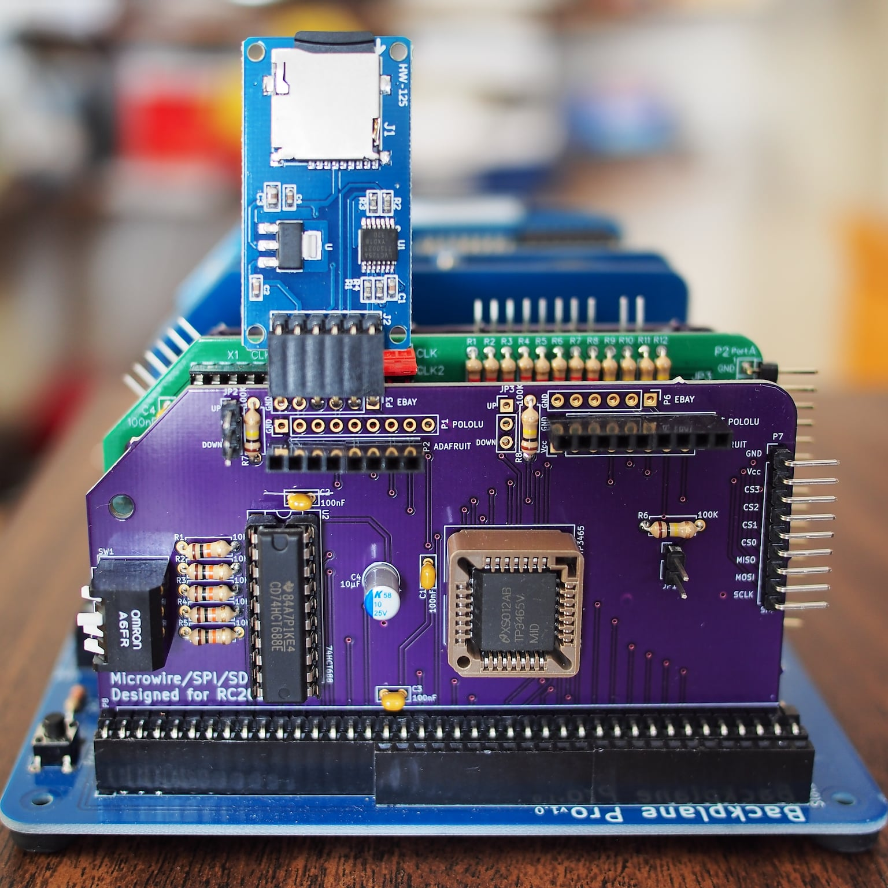

# SPI/Microwire Interface Designed For RC2014

This is an SPI/Microwire interface card designed for the RC2014 microcomputer system based upon National Semiconductor's TP3465 Microwire Interface Device. Its primary intent is to provide a reasonably fast interface to two SD cards in an RC2014 system, although it can potentially be used to communicate with up to four SPI devices with some limitations:

- only SPI modes 0 and 2 are supported (i.e. CPOL=0 or 1, CPHA=0)
- the maximum clock rate is 5 MHz

## Build Notes

Until this is properly documented, refer to the [schematic](mid.pdf).

SD cards run at 3.3 volts but the RC2014 bus is 5 volts so it's expected an adapter with built-in level shifters will be used. Unfortunately there's no standard pinout so this board has footprints for three different MicroSD adapters: [Pololu](https://www.pololu.com/product/2587), [Adafruit](https://www.adafruit.com/product/254), and Catalex (labelled as 'EBAY' on the board as this is where they're most commonly found). Only the footprint(s) being used need to be populated, but note that the Catalex adapters always drive the MISO line so if one is used it must be the only device on the SPI bus.

Capacitors C1-C3 (100nF, MLCC) are power bypass/decoupling capacitors for each IC and C4 (10µF, electrolytic) provides additional transient decoupling for the TP3465 itself. R1-R5 (10kΩ) act as pull-ups for the chip select logic. R6 (100kΩ) is a pull-up for the MISO line as not all adapters provide one. (This is only useful if the Adafruit adapter is being used as the Pololu adapter already includes one and the Catalex adapter is constantly driving MISO. RomWBW already accounts for the lack of one in software so even on the Adafruit adapter it's probably unnecessary. If R6 is installed it can still be disabled by leaving jumper JP1 open.) R7 and R8 (100kΩ) are meant to either pull-up or pull-down the card detect lines for the two SD interfaces through JP2 and JP3, respectively. (These will probably be left off a future revision of this card: there doesn't seem to be any standard for whether card detect should be active high or active low, making use of these lines difficult. The Catalex adapter doesn't provide a card detect line at all. RomWBW doesn't use them even when they're available.)

## License

Copyright 2020 Chris Odorjan

This work is licensed under a [Creative Commons Attribution-ShareAlike 4.0 International License](http://creativecommons.org/licenses/by-sa/4.0/).
